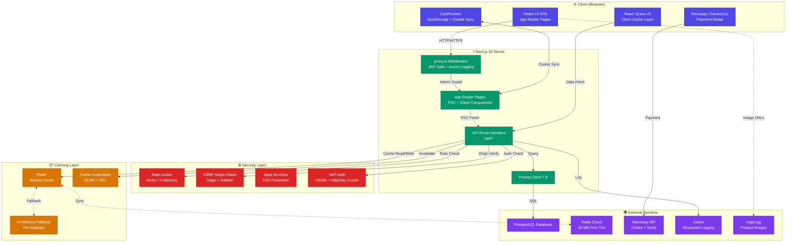
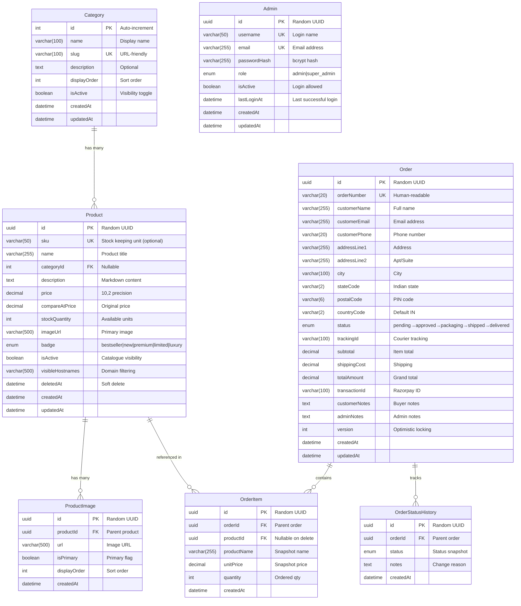
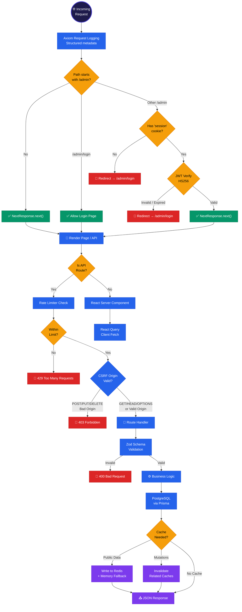
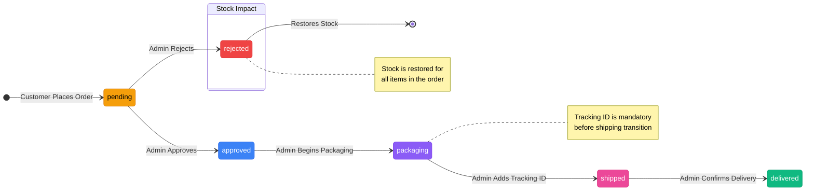
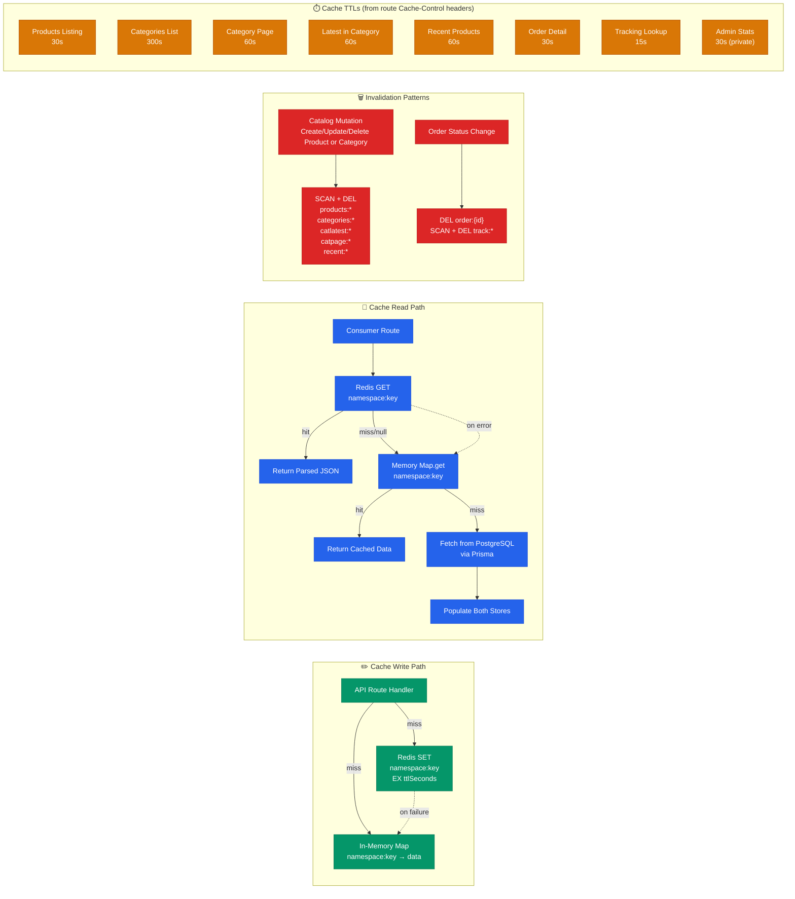
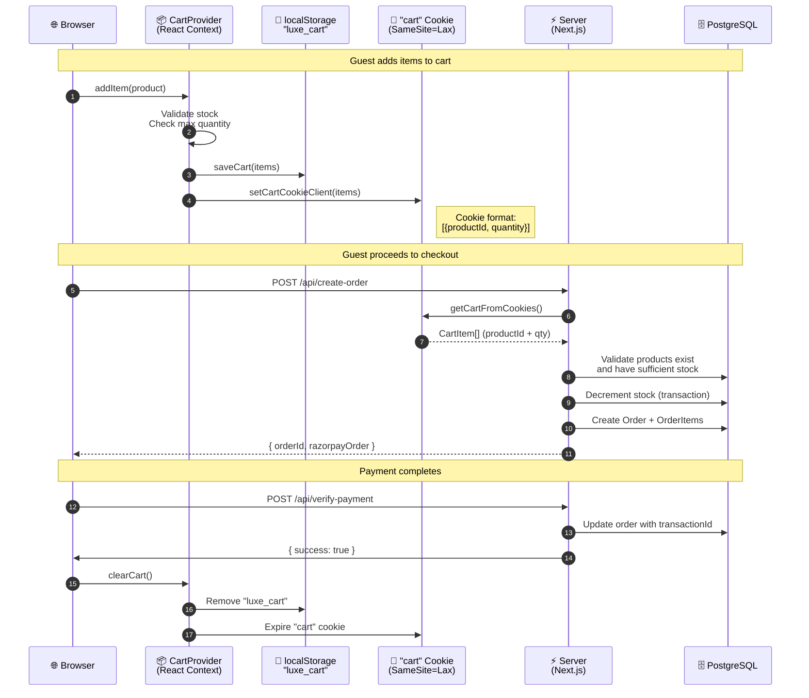
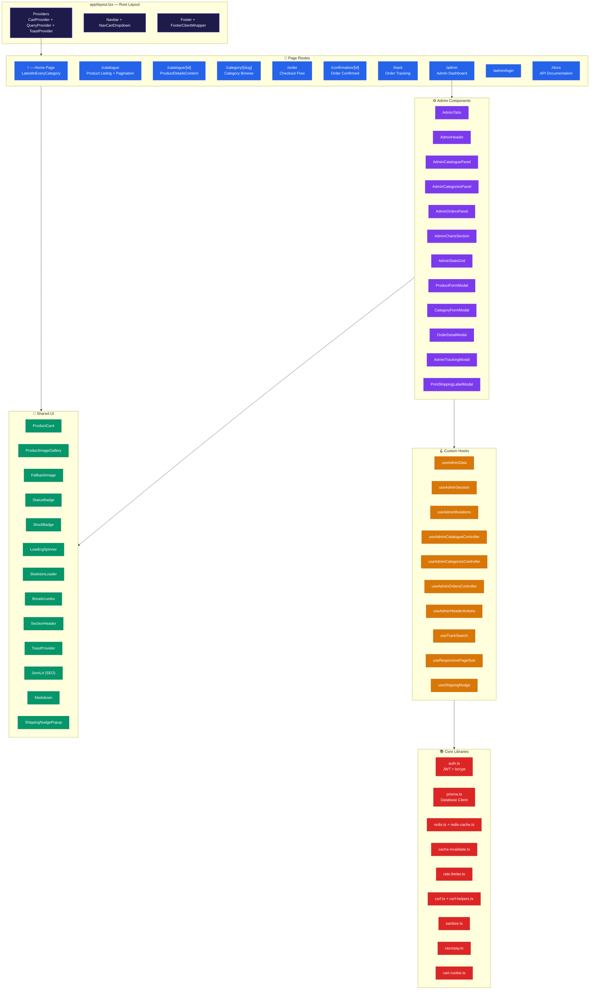
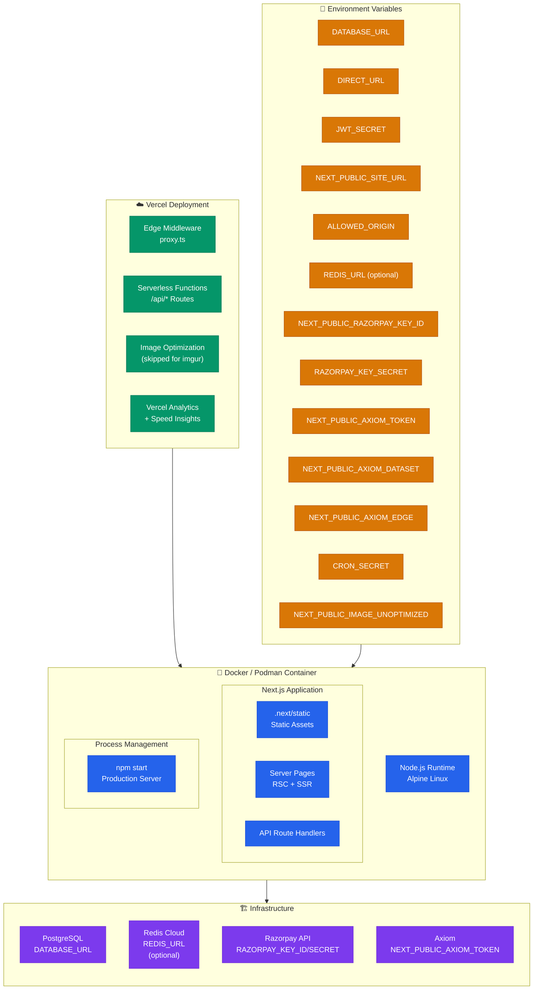

# Chinni Treasure — Architecture Diagrams

---

## 1. High-Level System Architecture

---

## 2. Database Entity Relationship Diagram

---

## 3. Request Pipeline & Middleware Flow

---

## 4. Order Status State Machine

---

## 5. Caching Architecture

---

## 6. Cart Synchronization Flow

---

## 7. Payment Flow (Razorpay + Manual Fallback)

```mermaid
flowchart TD
    Start["🛒 Checkout Page<br/>Customer Fills Address"]
    
    Start --> ValidateAddress{"Address<br/>Valid?"}
    ValidateAddress -->|"No: Invalid PIN,<br/>phone, or state"| ShowError["❌ Validation Error"]
    ValidateAddress -->|"Yes"| SelectPayment{"Payment<br/>Method?"}
    
    SelectPayment -->|"Online (Razorpay)"| CreateOrder["POST /api/create-order<br/>Server creates Razorpay order"]
    SelectPayment -->|"UPI / Bank Transfer"| ManualFlow["Manual Payment<br/>Display UPI ID / Bank Details"]
    
    CreateOrder --> RateLimit{"Rate Limit<br/>OK?"}
    RateLimit -->|"Exceeded"| TooMany["🚫 429"]
    RateLimit -->|"OK"| CSRF{"CSRF<br/>Valid?"}
    CSRF -->|"Failed"| Forbidden["🚫 403"]
    CSRF -->|"Passed"| StockCheck{"Stock<br/>Available?"}
    
    StockCheck -->|"Insufficient"| OOS["🚫 Out of Stock"]
    StockCheck -->|"OK"| Decrement["Decrement Stock<br/>(Prisma Transaction)"]
    Decrement --> CreateRZP["Create Razorpay Order<br/>razorpay.orders.create()"]
    CreateRZP --> ReturnClient["Return order_id<br/>+ razorpay_key"]
    
    ReturnClient --> OpenModal["Open Razorpay<br/>Checkout Modal"]
    OpenModal --> UserPays{"Payment<br/>Result?"}
    UserPays -->|"Success"| Verify["POST /api/verify-payment<br/>HMAC Signature Check"]
    UserPays -->|"Failed/Cancel"| RestoreStock["Restore Stock<br/>(background)"]
    
    Verify --> HMAC{"HMAC<br/>Valid?"}
    HMAC -->|"Invalid"| RejectOrder["Reject Order<br/>+ Restore Stock"]
    HMAC -->|"Valid"| Confirm["✅ Order Confirmed<br/>transactionId saved"]
    
    Confirm --> Redirect["→ /confirmation/[id]"]
    
    ManualFlow --> ShowDetails["Show Payment Details<br/>+ Order Created as pending"]
    ShowDetails --> AdminApprove["Admin Reviews<br/>in /admin panel"]

    classDef entry fill:#4F46E5,stroke:#3730A3,color:#FFFFFF
    classDef process fill:#2563EB,stroke:#1D4ED8,color:#FFFFFF
    classDef decision fill:#F59E0B,stroke:#D97706,color:#000000
    classDef success fill:#059669,stroke:#047857,color:#FFFFFF
    classDef error fill:#DC2626,stroke:#B91C1C,color:#FFFFFF
    classDef payment fill:#7C3AED,stroke:#6D28D9,color:#FFFFFF

    class Start entry
    class CreateOrder,Decrement,CreateRZP,ReturnClient,OpenModal,Verify,ShowDetails,AdminApprove process
    class ValidateAddress,SelectPayment,RateLimit,CSRF,StockCheck,UserPays,HMAC decision
    class Confirm,Redirect success
    class ShowError,TooMany,Forbidden,OOS,RejectOrder,RestoreStock error
    class ManualFlow,OpenModal payment
```

---

## 8. Authentication & Admin Security Flow

```mermaid
flowchart TB
    subgraph Login["🔐 Admin Login Flow"]
        LoginReq["POST /api/auth/login<br/>username + password"]
        LoginReq --> RateCheck{"Rate Limit<br/>≤ 5 / 60s"}
        RateCheck -->|"Exceeded"| Block["🚫 429"]
        RateCheck -->|"OK"| CSRFLogin{"CSRF Origin<br/>Valid?"}
        CSRFLogin -->|"No"| Deny["🚫 403"]
        CSRFLogin -->|"Yes"| Lookup["Find Admin<br/>by username"]
        Lookup -->|"Not found"| BadCreds["🚫 401"]
        Lookup -->|"Found"| Bcrypt["bcrypt.compare<br/>password → hash"]
        Bcrypt -->|"Mismatch"| BadCreds
        Bcrypt -->|"Match"| SignJWT["Sign JWT<br/>HS256, 24h expiry"]
        SignJWT --> SetCookie["Set HttpOnly Cookie<br/>'session' = JWT<br/>SameSite=Lax, Secure"]
        SetCookie --> Dashboard["→ /admin Dashboard"]
    end

    subgraph Protected["🛡️ Protected Route Guard"]
        AdminRoute["Admin Page Request"]
        AdminRoute --> Proxy["proxy.ts Middleware"]
        Proxy --> ExtractCookie["Extract 'session' cookie"]
        ExtractCookie --> HasToken{"Token<br/>exists?"}
        HasToken -->|"No"| Redirect["🔄 → /admin/login"]
        HasToken -->|"Yes"| Verify["jose.jwtVerify<br/>HS256"]
        Verify -->|"Invalid/Expired"| Redirect
        Verify -->|"Valid"| Allow["✅ Serve Admin Page"]
    end

    subgraph Session["📋 Session Management"]
        MeEndpoint["GET /api/auth/me"]
        MeEndpoint --> CheckAuth["checkAuth()"]
        CheckAuth --> ParseSession["Parse JWT payload"]
        ParseSession --> ZodSchema["Validate with Zod<br/>{id, username, role}"]
        ZodSchema -->|"Valid"| ReturnAdmin["Return Admin Info"]
        ZodSchema -->|"Invalid"| ReturnNull["Return null"]
    end

    subgraph Logout["🚪 Logout"]
        LogoutReq["POST /api/auth/logout"]
        LogoutReq --> ClearCookie["Clear 'session' cookie<br/>Max-Age=0"]
        ClearCookie --> LoginPage["→ /admin/login"]
    end

    classDef loginStyle fill:#2563EB,stroke:#1D4ED8,color:#FFFFFF
    classDef guardStyle fill:#7C3AED,stroke:#6D28D9,color:#FFFFFF
    classDef sessionStyle fill:#059669,stroke:#047857,color:#FFFFFF
    classDef logoutStyle fill:#D97706,stroke:#B45309,color:#FFFFFF
    classDef errorStyle fill:#DC2626,stroke:#B91C1C,color:#FFFFFF

    class LoginReq,Lookup,Bcrypt,SignJWT,SetCookie,Dashboard loginStyle
    class AdminRoute,Proxy,ExtractCookie,Verify,Allow guardStyle
    class MeEndpoint,CheckAuth,ParseSession,ZodSchema,ReturnAdmin,ReturnNull sessionStyle
    class LogoutReq,ClearCookie,LoginPage logoutStyle
    class Block,Deny,BadCreds,Redirect errorStyle
```

---

## 9. Component Architecture

---

## 10. Deployment & Container Architecture

