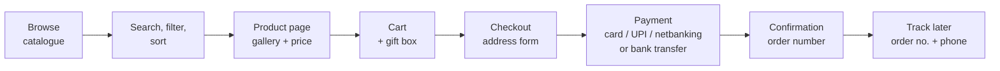
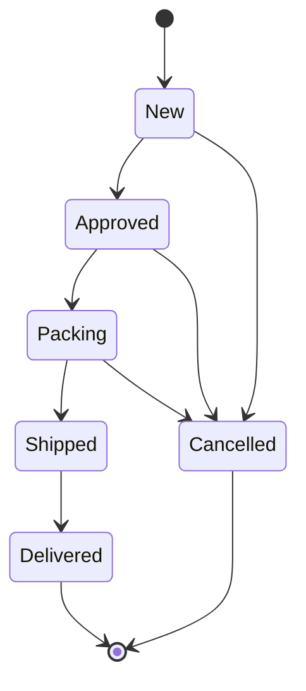

# Project Overview (Non-Technical)

Audience: business, operations, and support. No technical background needed.

## What is Chinni Treasure?

An online store for jewellery and gift products, selling across India. Customers browse the catalogue on the website, add items to a cart, and pay online. Meanwhile the business manages products, categories, stock levels, and orders from a private admin dashboard.

It is a single website that does both jobs — the public shop and the staff dashboard. There isn't a separate back-office system to learn.

## How a customer shops

<table fit-page-width="true">
	<tr>
		<td>1</td>
		<td>**Browse** — the homepage and catalogue pages show products by category, with photos, prices, and sale badges</td>
	</tr>
	<tr>
		<td>2</td>
		<td>**Search and filter** — customers can search, narrow by category, and sort by price, newest, or popularity</td>
	</tr>
	<tr>
		<td>3</td>
		<td>**Product page** — larger photo gallery with zoom, full description, stock status, and price with the original MRP struck through when there's a discount</td>
	</tr>
	<tr>
		<td>4</td>
		<td>**Cart** — add items, adjust quantities, and pick an optional gift box. The cart remembers what was added even if the browser is closed, and shows a progress bar toward free shipping</td>
	</tr>
	<tr>
		<td>5</td>
		<td>**Checkout** — a short form for name, phone, and delivery address. Indian mobile numbers, PIN codes, and state selection are checked as the customer types, so mistakes are caught before payment</td>
	</tr>
	<tr>
		<td>6</td>
		<td>**Payment** — card, UPI, or netbanking through Razorpay, or the manual bank-transfer option confirmed once the transfer is done</td>
	</tr>
	<tr>
		<td>7</td>
		<td>**Confirmation** — an order number, a receipt, and a link to track the order later</td>
	</tr>
</table>

Customers don't need an account. To look an order up later they need the **order number plus the phone number** used at checkout.

## How the business manages it

A separate, password-protected dashboard:

- **Dashboard** — sales figures, order counts, and simple charts.
- **Products** — add, edit, price, describe, and photograph products; reorder them; mark them active or hidden; set stock quantities; tag items as Bestseller, New, Premium, Limited Edition, or Luxury.
- **Categories** — create and rename categories, and control the order they appear in on the storefront.
- **Orders** — every order with its items, amounts, and customer details. Move each order through the fulfilment stages, add internal notes, and record the courier tracking number.
- **Shipping labels** — print a packing slip at pack time. Staff can edit quantities on the label before printing if something's off.
- **Export** — download catalogue and order data as a spreadsheet for accounting or bulk edits.

## The order journey

- Orders move forward **one step at a time**. Nothing skips a stage, and nothing goes back out of a finished state.
- A tracking number **must** be recorded before an order can be marked Shipped — so every shipped parcel is traceable.
- If an order is cancelled, the reserved stock automatically returns to inventory.

## Business rules worth remembering

<table fit-page-width="true" header-row="true">
	<tr>
		<td>Rule</td>
		<td>What it means in practice</td>
	</tr>
	<tr>
		<td>Free shipping over ₹599</td>
		<td>Below that, a flat ₹150 (Tamil Nadu) or ₹200 (rest of India) applies</td>
	</tr>
	<tr>
		<td>Stock is only reduced on a real order</td>
		<td>Browsing or abandoning a checkout doesn't consume inventory. Cancelling returns it.</td>
	</tr>
	<tr>
		<td>Gift boxes are priced in</td>
		<td>A gift box added at checkout is included in the order total, so the charged amount and the recorded amount always match</td>
	</tr>
	<tr>
		<td>A category can't be deleted while products use it</td>
		<td>Reassign or remove its products first</td>
	</tr>
	<tr>
		<td>Multiple domains</td>
		<td>The store can show different products on different domains — useful for regional or partner sites</td>
	</tr>
	<tr>
		<td>Card details never touch our systems</td>
		<td>Payments are handled by Razorpay; the store never sees or stores card numbers</td>
	</tr>
	<tr>
		<td>Order details are private</td>
		<td>Visible to staff, or to a customer who supplies both the order number and their phone number</td>
	</tr>
</table>

## Why a paid order can't silently vanish

If a customer's money left their account but no order appears, the system checked with the payment provider before recording anything. If the amount charged doesn't match the order total, or the payment didn't actually go through, **the order is rejected and no stock is taken**. So an order in the system is an order that was genuinely paid.

The one exception is manual bank transfer, where there's no provider record to compare against — reconciliation there is a staff responsibility.

## Common questions

**A customer says they were charged but see no order.**
Check the Razorpay transaction reference against the order list. Failed or abandoned payments leave no order behind by design.

**A customer can't find their order.**
They need both the order number *and* the phone number used at checkout — one alone isn't enough. This is intentional, so that nobody can look up an order using only a guessed order number.

**Can we delete a category?**
Only if no products are assigned to it. Reassign or remove its products first.

**Something changed on the site — when does it show up?**
Nearly immediately for catalogue changes. Product listings, category pages, and search all refresh automatically after an admin edit.

**Can we run this ourselves instead of Vercel?**
Yes. A Docker setup is supported as a self-hosting path. The team would need to own the server and database backups directly.

**Where do we stand technically?**
The application is modern and actively maintained, with automated tests covering the API, business rules, and key customer flows. It's deployed on Vercel, with an optional Redis cache for extra speed at higher traffic.

---

For the engineer's view of the same system — architecture, data model, and security rules — see the **Technical Overview** subpage.