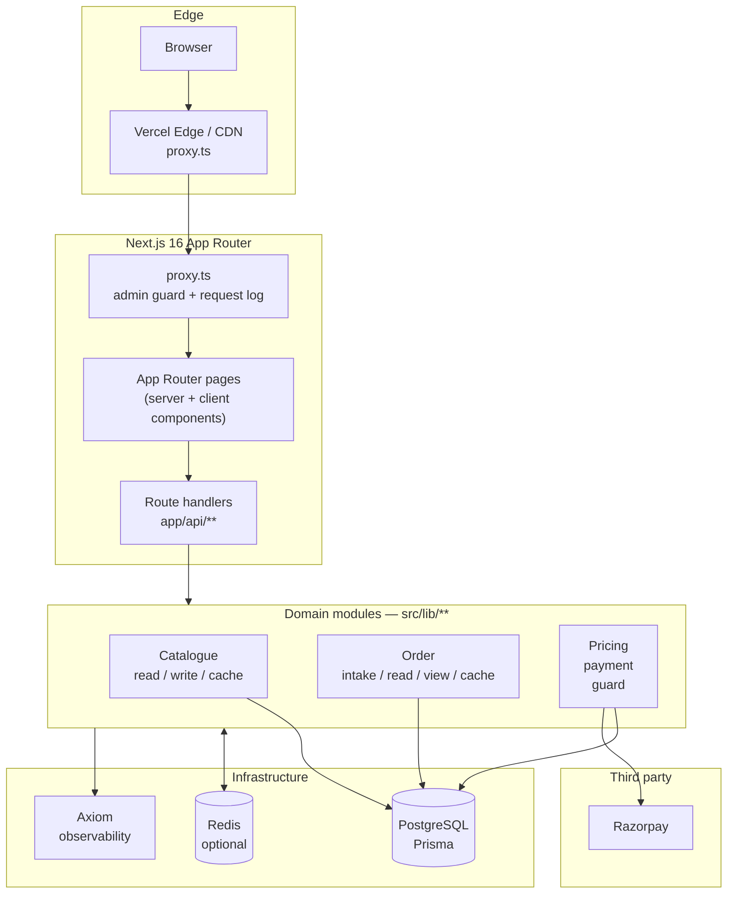
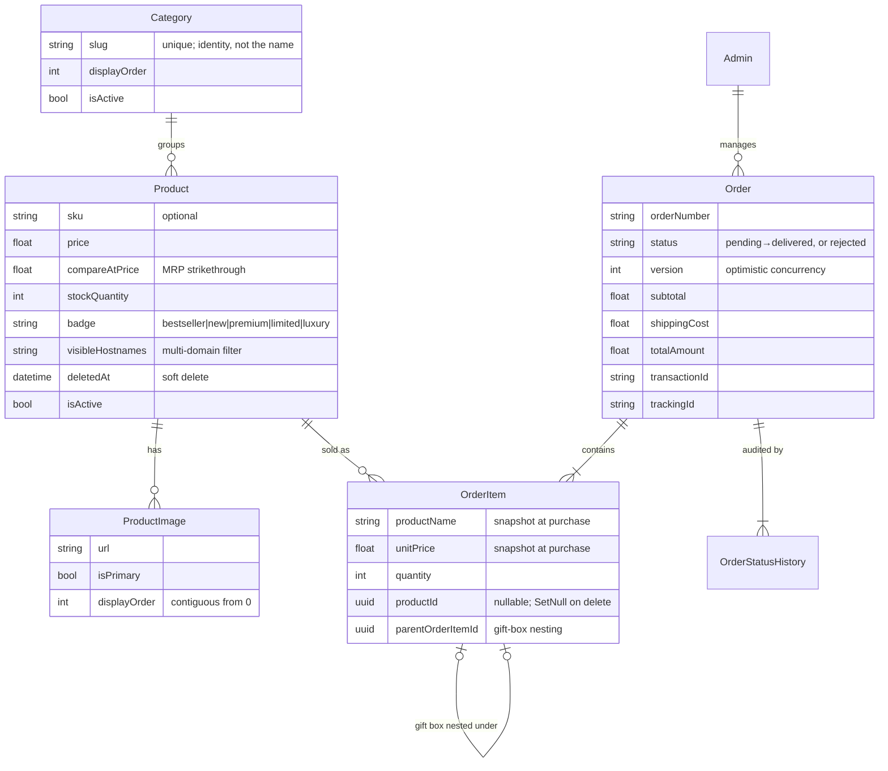
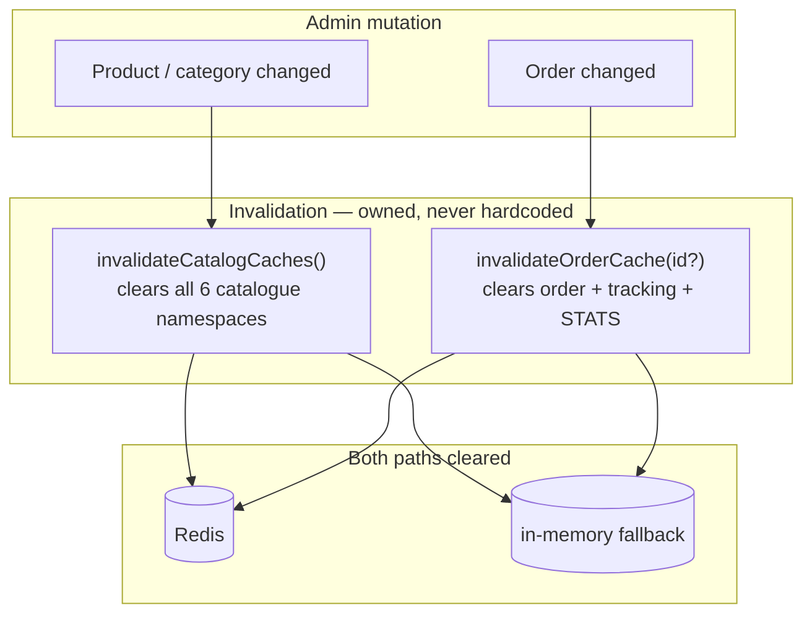
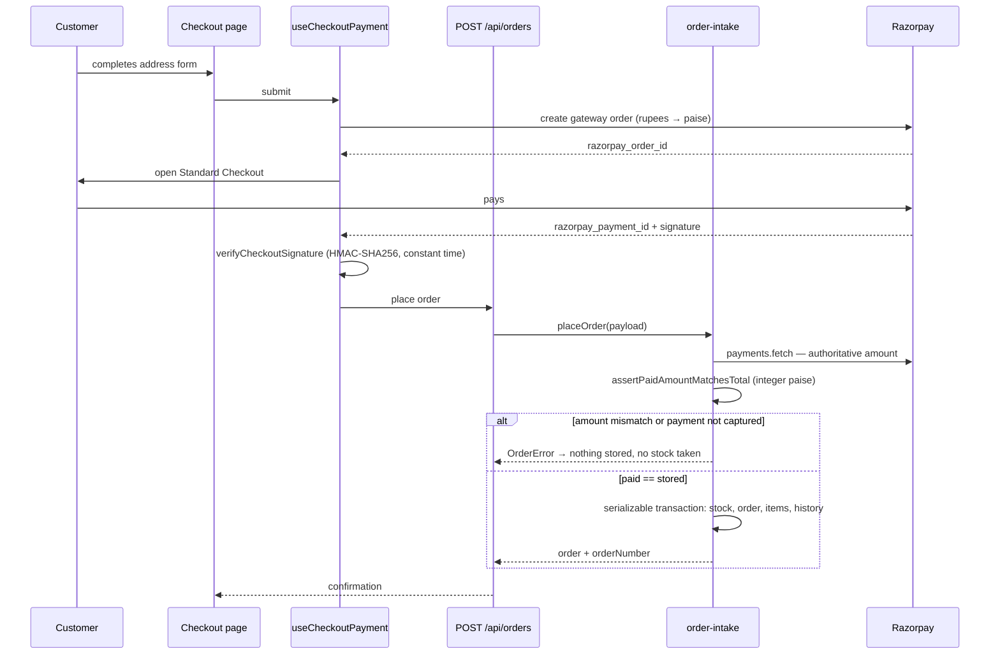
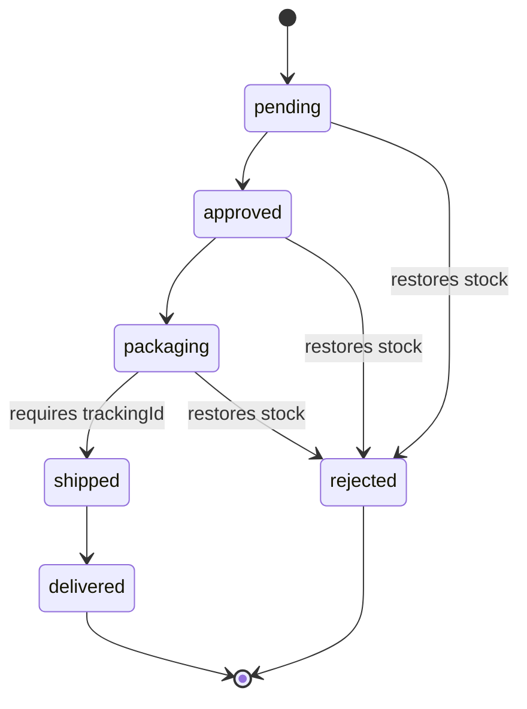

# Technical Overview

Audience: engineers joining or reviewing this codebase.

**Before you start:** read [`CONTEXT.md`](https://github.com/deepak-sekarbabu-coder/chinni-treasure/blob/main/CONTEXT.md). It is the domain glossary and the record of every architecture decision — including the ones already made, so you don't re-propose them. For workflow and guardrails, read [`AGENTS.md`](https://github.com/deepak-sekarbabu-coder/chinni-treasure/blob/main/AGENTS.md).

## 1. What this is

A luxury e-commerce storefront for jewellery and gift products. One Next.js application serves both the public storefront and the internal admin dashboard — there is no separate backend service. The App Router's API routes *are* the backend.

## 2. Runtime architecture



`proxy.ts` is the request entry point: it logs page traffic to Axiom and protects `/admin/*` by verifying the admin JWT. API routes are excluded from the page-traffic matcher.

## 3. Stack

<table fit-page-width="true" header-row="true">
	<tr>
		<td>Layer</td>
		<td>Choice</td>
		<td>Notes</td>
	</tr>
	<tr>
		<td>Framework</td>
		<td>Next.js 16.3.x, App Router</td>
		<td>Deliberate server/client split; `npm run check:static-dynamic` enforces the boundary</td>
	</tr>
	<tr>
		<td>UI</td>
		<td>React 19.2, React Context, React Query 5</td>
		<td>React Query only for client-side server state; cart state is Context, not React Query</td>
	</tr>
	<tr>
		<td>Styling</td>
		<td>Modular raw CSS under `app/styles/`</td>
		<td>**No Tailwind or CSS framework, by policy**</td>
	</tr>
	<tr>
		<td>Database</td>
		<td>PostgreSQL via Prisma 7.9 + `@prisma/adapter-pg`</td>
		<td>`prisma/schema.prisma` is the source of truth</td>
	</tr>
	<tr>
		<td>Validation</td>
		<td>Zod 4 in `src/lib/api/schemas.ts`</td>
		<td>One contract; the OpenAPI docs at `/api/docs` are *generated* from it</td>
	</tr>
	<tr>
		<td>Auth</td>
		<td>JWT admin session in an HttpOnly `session` cookie</td>
		<td>Verified in `proxy.ts` and `src/lib/auth.ts`</td>
	</tr>
	<tr>
		<td>Payments</td>
		<td>Razorpay Standard Checkout + manual UPI/bank transfer</td>
		<td>Signature verification and amount verification are both server-side</td>
	</tr>
	<tr>
		<td>Caching</td>
		<td>Redis when `REDIS_URL` is set, in-memory fallback otherwise</td>
		<td>Optional infra; the fallback is per-instance in serverless</td>
	</tr>
	<tr>
		<td>Observability</td>
		<td>Axiom helpers under `lib/axiom/`</td>
		<td>Request logs, route events, Web Vitals, error instrumentation</td>
	</tr>
	<tr>
		<td>Testing</td>
		<td>Vitest 4 + Testing Library + jsdom</td>
		<td>~100 test files; module interfaces are the test surface, not HTTP</td>
	</tr>
	<tr>
		<td>Hosting</td>
		<td>Vercel, with a Docker/Podman self-host path</td>
		<td>Vercel runs a daily `/api/cron/db-health` keep-alive</td>
	</tr>
</table>

## 4. Request surfaces

<table fit-page-width="true" header-row="true">
	<tr>
		<td>Surface</td>
		<td>Routes</td>
	</tr>
	<tr>
		<td>Public storefront</td>
		<td>`/catalogue`, `/catalogue/[id]`, `/category/[slug]`, homepage "Latest in Every Category"</td>
	</tr>
	<tr>
		<td>Purchase flow</td>
		<td>`/order` (checkout), `/confirmation/[id]`, `/track`</td>
	</tr>
	<tr>
		<td>Admin</td>
		<td>`/admin/*` — gated by the session cookie and JWT verification at the proxy</td>
	</tr>
	<tr>
		<td>API</td>
		<td>Auth, catalogue, categories, orders, payments, stats, health, docs, cron</td>
	</tr>
</table>

## 5. Data model

Seven models: `Category`, `Product`, `ProductImage`, `Order`, `OrderItem`, `OrderStatusHistory`, `Admin`.



Two details that bite people:

- **`OrderItem` snapshots `productName` and `unitPrice` at purchase time.** Renaming or repricing a product never rewrites history.
- **`OrderItem.productId` is nullable** and set to `NULL` when the product is soft-deleted. The order line survives; the catalogue link doesn't.

## 6. The architecture that matters

This codebase is organised around **deep modules** — small interfaces hiding large implementations — and `CONTEXT.md` tracks each one as a *seam*. One rule explains most of the structure:

```mermaid
flowchart LR
    subgraph Routes["Route handlers — thin adapters"]
        direction TB
        R1["parse input"]
        R2["call module"]
        R3["map errors → HTTP"]
    end
    subgraph Guard["route-guard.ts<br/>CSRF · session · rate limit · error taxonomy"]
        G["withAdmin / withPublic"]
    end
    subgraph Modules["Domain modules — policy lives here"]
        M1["Catalogue"]
        M2["Order"]
        M3["Pricing"]
        M4["Payment"]
    end
    subgraph Cache["Owned caches"]
        C1["catalogue-cache"]
        C2["order-cache"]
        C3["stats-cache"]
    end
    Routes --> Guard --> Modules
    Modules <--> Cache
```

<callout icon="🎯" color="green_bg">
	<strong>A route handler is a thin adapter.</strong> It parses input, calls a module, and maps errors to HTTP. Business policy does not live in route handlers.
</callout>



### The modules

<table fit-page-width="true" header-row="true">
	<tr>
		<td>Module</td>
		<td>Owns</td>
	</tr>
	<tr>
		<td>`product-read.ts`</td>
		<td>All public catalogue SQL reads; the `isActive=all|inactive` status gate</td>
	</tr>
	<tr>
		<td>`catalogue-write.ts`</td>
		<td>Admin write policy: unique slug generation, gift-box bundling guards</td>
	</tr>
	<tr>
		<td>`order-intake.ts`</td>
		<td>Order placement (stock, pricing basis, serializable transaction) and fulfilment transitions</td>
	</tr>
	<tr>
		<td>`order-read.ts` / `order-cache.ts`</td>
		<td>Order reads, tracking lookup, the admin list, and cache invalidation</td>
	</tr>
	<tr>
		<td>`order-view.ts`</td>
		<td>The single Order read projection that confirmation, tracking, modals, and the PDF invoice all consume</td>
	</tr>
	<tr>
		<td>`pricing.ts`</td>
		<td>Subtotal, shipping (₹599 free threshold; ₹150 Tamil Nadu / ₹200 elsewhere), total</td>
	</tr>
	<tr>
		<td>`razorpay-server.ts`</td>
		<td>Gateway order creation, signature verification, authoritative paid-amount snapshot</td>
	</tr>
	<tr>
		<td>`route-guard.ts`</td>
		<td>`withAdmin` / `withPublic`: CSRF origin check, session policy, named rate limits, error taxonomy</td>
	</tr>
	<tr>
		<td>`catalogue-cache.ts`</td>
		<td>All six catalogue cache namespaces plus `invalidateCatalogCaches()`</td>
	</tr>
	<tr>
		<td>`cart-projections.ts`</td>
		<td>The three ways a cart crosses a boundary: cookie wire, money lines, order-intake payload</td>
	</tr>
	<tr>
		<td>`sort-contract.ts`</td>
		<td>The one catalogue sort vocabulary (`SORT_OPTIONS`) — dependency-free so the client can import it</td>
	</tr>
	<tr>
		<td>`product-display.ts`</td>
		<td>Low-stock threshold, the one primary-image picker, discount math</td>
	</tr>
	<tr>
		<td>`image-set.ts`</td>
		<td>The gallery invariant: exactly one primary image, contiguous `displayOrder` from 0</td>
	</tr>
	<tr>
		<td>`gift-box.ts`</td>
		<td>The one identity predicate for the Gift Box category and the one bundling-eligibility answer</td>
	</tr>
	<tr>
		<td>`openapi-spec.ts`</td>
		<td>Derives the `/api/docs` spec from the Zod schemas, so docs can't drift from the contract</td>
	</tr>
</table>

### Cache ownership

Caching is the most frequently misunderstood part of this codebase, so it has an ADR: [ADR-0001](https://github.com/deepak-sekarbabu-coder/chinni-treasure/blob/main/docs/adr/ADR-0001-cache-ownership.md).



Three rules:

1. **A route never creates a cache inline.** It imports the module that owns the concept.
2. **A route never keys a cache either.** The key, the hit/miss branch, and the response's own validation all live behind the owning module's read surface.
3. **Mutating an Order invalidates Order caches *and* stats**, because stats derive from orders. Mutating any catalogue entity invalidates the whole Catalogue.

Stats-cache invalidation is owned by `order-cache.ts`, not by the stats module — the dependency runs from derived data back to its source.

### Security boundaries

<table fit-page-width="true" header-row="true">
	<tr>
		<td>Boundary</td>
		<td>Rule</td>
	</tr>
	<tr>
		<td>Cart state</td>
		<td>Two representations — client guest cart and a signed server-side cookie — both projected through `cart-projections.ts`</td>
	</tr>
	<tr>
		<td>Inactive products</td>
		<td>`GET /api/products?isActive=all|inactive` requires an admin session and answers `private, no-store`. The gate lives at the route seam so no branch can forget it</td>
	</tr>
	<tr>
		<td>Product visibility</td>
		<td>Active / soft-deleted / hostname checks run **outside** the cache, so one host's verdict is never served to another</td>
	</tr>
	<tr>
		<td>Unauthenticated order reads</td>
		<td>Two-factor: order id *and* a matching phone, rate-limited. A phone mismatch returns 404, not 403, so the endpoint can't be probed for valid ids</td>
	</tr>
	<tr>
		<td>Payment amount</td>
		<td>The charged amount is fetched from Razorpay server-side — a client-claimed amount is never trusted — and asserted equal to the stored total before persistence ([ADR-0002](https://github.com/deepak-sekarbabu-coder/chinni-treasure/blob/main/docs/adr/ADR-0002-pricing-basis-gift-boxes.md))</td>
	</tr>
	<tr>
		<td>Stock</td>
		<td>Deducted atomically inside a serializable transaction at placement; restored automatically on rejection</td>
	</tr>
	<tr>
		<td>Admin session</td>
		<td>JWT decoded and verified server-side; passwords hashed only through the helpers in `src/lib/auth.ts`</td>
	</tr>
</table>

### Checkout payment sequence



## 7. Order lifecycle



- Transitions are validated server-side against this flow — **no stage can be skipped**, and neither `delivered` nor `rejected` can be left.
- Every transition is guarded by the order's `version` field for optimistic concurrency, so two admins acting on the same order can't silently overwrite each other.
- A tracking ID is **required** before `packaging → shipped`.
- Rejecting an order restores its reserved stock atomically.

## 8. Commands

```bash
npm run dev                      # dev server
npm run build                    # boundary check + prisma generate + build
npm run lint                     # boundary check + eslint
npm run lint:fix                 # eslint with fixes
npm run typecheck                # tsc --noEmit
npm run test:run                 # vitest once
npm run test:coverage            # with coverage
npm run db:setup                 # generate client + push schema + seed
npm run check:static-dynamic     # server/client component boundary rules
npm run lighthouse               # performance audit against budgets
npm run fallow                   # code-quality analysis
```

## 9. Contribution guardrails

<table fit-page-width="true" header-row="true">
	<tr>
		<td>#</td>
		<td>Rule</td>
	</tr>
	<tr>
		<td>1</td>
		<td>New styles go in the relevant file under `app/styles/`. Never add feature CSS to `app/globals.css`; preserve the tokens in `variables.css`.</td>
	</tr>
	<tr>
		<td>2</td>
		<td>Verify and decode admin JWTs server-side. Use the password helpers in `src/lib/auth.ts` — no ad hoc hashing.</td>
	</tr>
	<tr>
		<td>3</td>
		<td>Keep API validation schema-driven through Zod. Sanitise user-facing content through `src/lib/sanitize.ts`.</td>
	</tr>
	<tr>
		<td>4</td>
		<td>Preserve checkout phone / PIN / address rules, price and stock validation, and the order-transition rules above.</td>
	</tr>
	<tr>
		<td>5</td>
		<td>Keep visible focus styles, 44×44px minimum mobile tap targets, and reduced-motion support intact.</td>
	</tr>
	<tr>
		<td>6</td>
		<td>Maintain loading, error, empty, and not-found states on any data-fetching route or component.</td>
	</tr>
	<tr>
		<td>7</td>
		<td>Update `.env.example` whenever a new environment variable is introduced. Never commit real `.env` files.</td>
	</tr>
	<tr>
		<td>8</td>
		<td>Run the *smallest* verification that proves the change is safe — see the table below.</td>
	</tr>
</table>

<table fit-page-width="true" header-row="true">
	<tr>
		<td>Change type</td>
		<td>Run</td>
	</tr>
	<tr>
		<td>Types or shared contracts</td>
		<td>`npm run typecheck`</td>
	</tr>
	<tr>
		<td>Behaviour, API, cache, hooks, components</td>
		<td>`npm run test:run`</td>
	</tr>
	<tr>
		<td>UI, hooks, routes, static-safety</td>
		<td>`npm run lint`</td>
	</tr>
	<tr>
		<td>Next.js config, Prisma, route boundaries, deployment</td>
		<td>`npm run build`</td>
	</tr>
</table>

## 10. Known residuals

Two open items are recorded in `CONTEXT.md`, so you're not the first to see them:

- `product-read.ts` still exports `ProductView` and `CatalogueProductView` as structural copies of the Zod schema types. They have no external importers, so this is a cleanup rather than a design question.
- The categories admin panel is deliberately a client-sorted, unpaged table. It uses the shared card frame but not the shared `useAdminListTable` — an intentional exception, not an oversight.

## 11. Where to start reading

<table fit-page-width="true">
	<tr>
		<td>1</td>
		<td><a href="https://github.com/deepak-sekarbabu-coder/chinni-treasure/blob/main/AGENTS.md">AGENTS.md</a> — workflow, guardrails, full command table</td>
	</tr>
	<tr>
		<td>2</td>
		<td><a href="https://github.com/deepak-sekarbabu-coder/chinni-treasure/blob/main/CONTEXT.md">CONTEXT.md</a> — domain glossary and every architecture seam, with rationale</td>
	</tr>
	<tr>
		<td>3</td>
		<td><a href="https://github.com/deepak-sekarbabu-coder/chinni-treasure/blob/main/prisma/schema.prisma">prisma/schema.prisma</a> — the data model</td>
	</tr>
	<tr>
		<td>4</td>
		<td><code>src/lib/order-intake.ts</code> and <code>src/lib/route-guard.ts</code> — the two modules that best show the house style</td>
	</tr>
	<tr>
		<td>5</td>
		<td><a href="https://github.com/deepak-sekarbabu-coder/chinni-treasure/tree/main/docs/adr">docs/adr/</a> — why the system works this way</td>
	</tr>
</table>