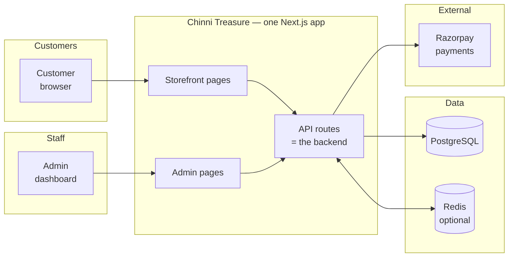

# Chinni Treasure — Documentation

Chinni Treasure is an online store for jewellery and gift products, selling across India. Customers browse the catalogue, add items to a cart, and pay online. The business manages products, categories, stock, and orders from a private admin dashboard.

<callout icon="👋" color="blue_bg">
This page is the entry point. Choose the version that matches who you are — the two subpages cover the same project for very different readers.
</callout>

## Choose your version

<table fit-page-width="true" header-row="true">
	<tr>
		<td>Reader</td>
		<td>Go to</td>
		<td>Covers</td>
	</tr>
	<tr>
		<td>Engineer, technical reviewer, new contributor</td>
		<td>**Technical Overview** (subpage)</td>
		<td>Stack, data model, module architecture, security boundaries, cache rules, contribution guardrails</td>
	</tr>
	<tr>
		<td>Business, operations, support</td>
		<td>**Project Overview (Non-Technical)** (subpage)</td>
		<td>Customer shopping journey, admin dashboard, order lifecycle, business rules, support FAQ</td>
	</tr>
</table>

## The short version, for everyone

Chinni Treasure is a **single web application** that serves both the public storefront and the internal admin dashboard. There is no separate backend service — the API routes inside the web app *are* the backend.

### What the system does

- **Catalogue** — products organised into categories, with photos, prices, compare-at pricing, and badges.
- **Cart and checkout** — a guest cart that persists across visits, with Indian phone, PIN, address, and state validation. Payment through Razorpay (card, UPI, netbanking) or a manual bank-transfer fallback.
- **Orders** — every order moves through a fixed lifecycle: `pending → approved → packaging → shipped → delivered`, with `rejected` as an off-ramp that restores stock. A tracking ID is required before an order can be marked shipped.
- **Admin** — a password-protected dashboard for products, categories, stock, order fulfilment, printable packing labels, dashboard stats, and spreadsheet export.
- **Payments are verified server-side.** The amount actually charged by the payment gateway is fetched from Razorpay's own records and compared against the order total. A mismatch aborts the order entirely — nothing is stored and no stock is deducted.
- **Customer data is protected.** Order details are visible to staff, or to a customer who supplies both the order number and the phone number used at checkout. A wrong phone number returns "not found" rather than "forbidden", so the endpoint can't be used to discover which order numbers exist.

## Current technical shape

Next.js 16 (App Router) with React 19, PostgreSQL through Prisma, Zod for all API validation, JWT admin sessions in an HttpOnly cookie, optional Redis caching, and Axiom observability. Deployed on Vercel, with a Docker/Podman self-hosting path.

## Where the source of truth lives

The canonical documentation is in the GitHub repository, not in Notion. These pages are a reading guide, not a replacement.

<table fit-page-width="true" header-row="true">
	<tr>
		<td>Document</td>
		<td>Purpose</td>
	</tr>
	<tr>
		<td><a href="https://github.com/deepak-sekarbabu-coder/chinni-treasure/blob/main/AGENTS.md">AGENTS.md</a></td>
		<td>Agent workflow, architecture reference, guardrails, command table</td>
	</tr>
	<tr>
		<td><a href="https://github.com/deepak-sekarbabu-coder/chinni-treasure/blob/main/CONTEXT.md">CONTEXT.md</a></td>
		<td>Domain glossary — what each business word means</td>
	</tr>
	<tr>
		<td><a href="https://github.com/deepak-sekarbabu-coder/chinni-treasure/blob/main/docs/ARCHITECTURE.md">docs/ARCHITECTURE.md</a></td>
		<td>Every architecture seam, with rationale and review history</td>
	</tr>
	<tr>
		<td><a href="https://github.com/deepak-sekarbabu-coder/chinni-treasure/blob/main/prisma/schema.prisma">prisma/schema.prisma</a></td>
		<td>The data model — the definitive list of models, fields, and enums</td>
	</tr>
	<tr>
		<td><a href="https://github.com/deepak-sekarbabu-coder/chinni-treasure/tree/main/docs/adr">docs/adr/</a></td>
		<td>Architecture Decision Records — why the system works the way it does</td>
	</tr>
	<tr>
		<td><a href="https://github.com/deepak-sekarbabu-coder/chinni-treasure/tree/main/docs/notion">docs/notion/</a></td>
		<td>The Markdown source of these three Notion pages</td>
	</tr>
</table>

<callout icon="📌" color="yellow_bg">
	<strong>Read CONTEXT.md and docs/ARCHITECTURE.md before proposing any refactor.</strong> The first gives you the vocabulary; the second records which architecture questions have already been answered and why, so the same proposal doesn't get re-litigated.
</callout>

## The three decisions that explain most of the code

Full reasoning is in `docs/adr/`. In short:

<table fit-page-width="true" header-row="true">
	<tr>
		<td>ADR</td>
		<td>Decision</td>
		<td>Consequence in practice</td>
	</tr>
	<tr>
		<td><a href="https://github.com/deepak-sekarbabu-coder/chinni-treasure/blob/main/docs/adr/ADR-0001-cache-ownership.md">0001 — Cache ownership</a></td>
		<td>Caches are owned by domain modules, never created inline in routes, never invalidated from a central hardcoded list</td>
		<td>Any catalogue change clears every catalogue cache; any order change clears order caches and dashboard stats</td>
	</tr>
	<tr>
		<td><a href="https://github.com/deepak-sekarbabu-coder/chinni-treasure/blob/main/docs/adr/ADR-0002-pricing-basis-gift-boxes.md">0002 — Pricing basis</a></td>
		<td>Order subtotals include gift-box prices, so the amount charged always equals the amount stored</td>
		<td>Checkout preview, free-shipping threshold, and the order record can never disagree</td>
	</tr>
	<tr>
		<td>0003 — Document line projections</td>
		<td>Operator artifacts (packing label, Excel export) keep their own flat row shapes; one projection serves read-only surfaces</td>
		<td>Staff can edit a label's rows at pack time without that shape leaking into customer-facing views</td>
	</tr>
</table>